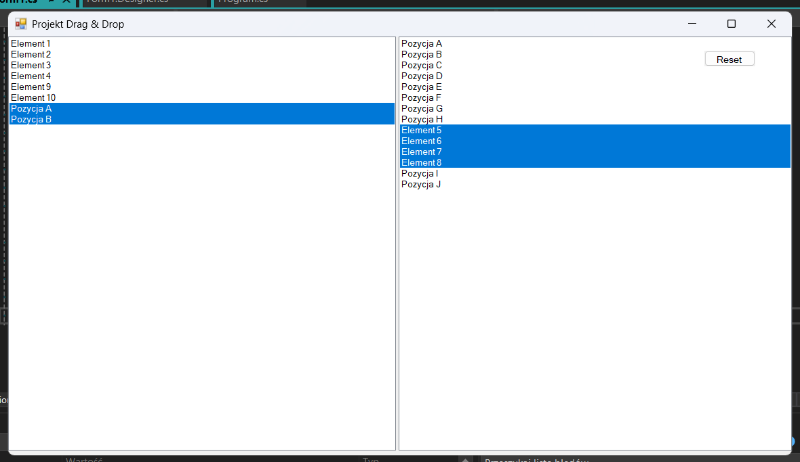

# Drag & Drop ListBox (Windows Forms)

Simple Windows Forms application demonstrating drag & drop between two ListBox controls.

## Features

* Drag items between two lists
* Move items (default behavior)
* Copy items using **CTRL**
* Insert items at the exact drop position
* Multi-selection support
* Reset button restoring initial state

## Screenshot



## Technologies

* C#
* .NET Framework
* Windows Forms

## How to run

1. Open the solution file:

```
DragAndDropLists.sln
```

2. Run the project in Visual Studio.

## Author

Krystian Marciniak
