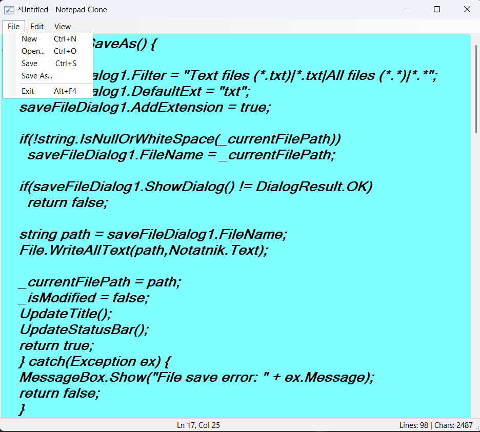

# Notepad Clone

Simple text editor built with **C# and Windows Forms**, inspired by the classic Windows Notepad.

The application allows creating, editing, opening and saving text files in a lightweight desktop interface.

---

## Features

* Create a new text document
* Open existing `.txt` files
* Save and Save As functionality
* Undo / Redo support
* Cut, Copy and Paste operations
* Font selection
* Text color selection
* Keyboard shortcuts
* Warning when closing with unsaved changes

---

## Technologies

* C#
* .NET Framework
* Windows Forms
* Visual Studio

---

## Screenshot



---

## How to run

1. Clone the repository:

```
git clone https://github.com/krystianmarciniak/notepad-clone.git
```

2. Open the solution file in **Visual Studio**

```
Notepad.sln
```

3. Build and run the application.

---

## Project purpose

This project was created as part of learning **C# desktop application development with Windows Forms**.

It demonstrates handling of:

* file operations
* text editing
* UI events
* basic application state management

---

## Author

Krystian Marciniak
