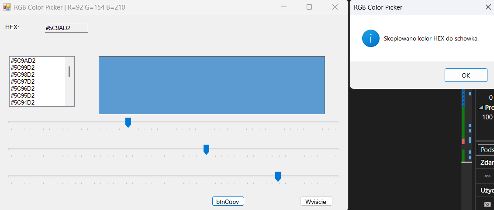

# RGB Color Picker

Simple Windows Forms application that allows selecting colors using RGB sliders.

The application dynamically updates the preview color using TrackBar controls and displays the selected color in both **RGB** and **HEX** formats.

---

## Features

- RGB color selection using sliders
- Real-time preview of the selected color
- HEX color code generation (#RRGGBB)
- Copy HEX color to clipboard
- Color history list (last selected colors)
- Window title displays current RGB values
- Exit button and ESC key support
- Simple and responsive Windows Forms UI

---

## Technologies

- C#
- .NET Framework
- Windows Forms (WinForms)
- Visual Studio

---

## Screenshot



---

## How to run

### 1. Clone the repository

```bash
git clone https://github.com/krystianmarciniak/rgb-color-picker.git