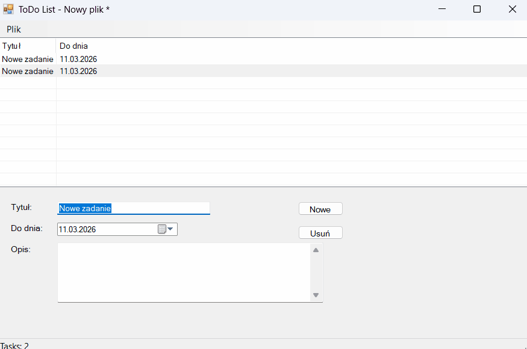

# ToDo List (WinForms)


Simple Windows Forms application for managing tasks.

## Demo



```
+---------------------+
| Form1 UI |
| ListView, inputs |
+----------+----------+
|
| BindingSource
|
+----------v----------+
| BindingList |
| <ToDoEntry> |
+----------+----------+
|
|
+----------v----------+
| ToDoEntry |
| title |
| due date |
| description |
+----------+----------+
|
|
+----------v----------+
| JSON file |
| save / load |
+---------------------+
```

## Running the application

1. Download or clone the repository.
2. Open `ToDoList.sln` in Visual Studio.
3. Build the solution.
4. Start the application.

## Author

Krystian Marciniak